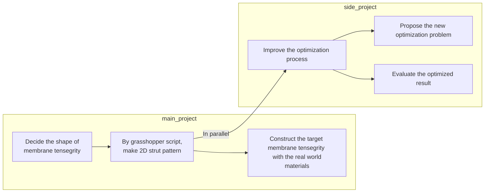
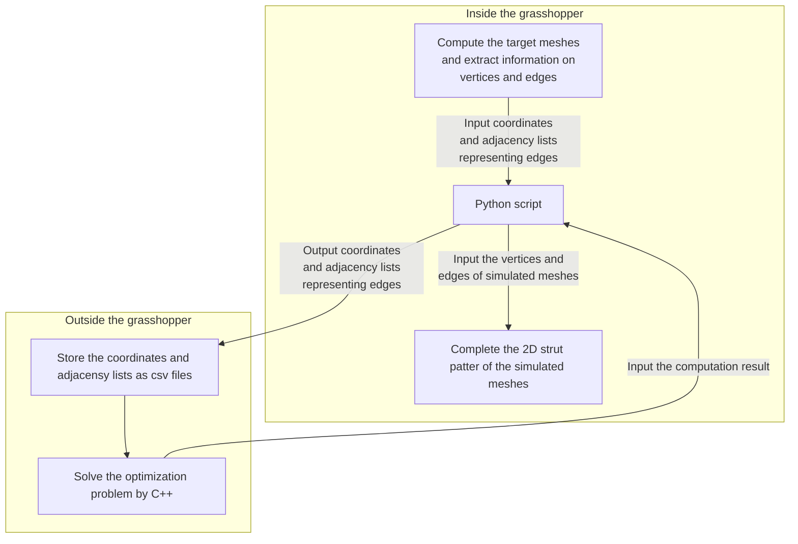
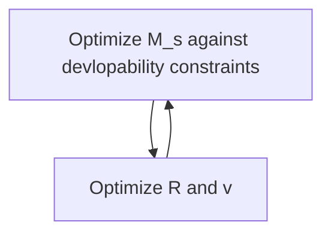

# membrane_tensegrity
## Initial setup
- Install Docker ([Official page](https://docs.docker.com/compose/install/))

- You can check if docker and docker-compose are available on your computer by the following command

```bash
docker -v
```
- If the message like the following is returned, it means you successfully installed Docker
```bash
Docker version 20.10.13, build a224086
```
- Check if docker-compose is available on your computer in the same way
```bash
docker-compose -v
```

- After the docker and docker-compose are set up, you can execute the following command to activate the docker environment on your computer

```bash
docker-compose up -d
```
- You can enter the docker container by the following command
```bash
docker container exec -it mt bash
```
- After entering the docker container, you can compile the C++ file for computing RMSD. The following command makes the executable file by the name of rmsd_calculator

```bash
bash build_rmsd.sh
```
- After compiling the file, you can compute RMSD by the following command

```bash
./rmsd_calculator
```

- If you want to work outside the docker container, you can execute the command outside the container
```bash
docker exec mt bash build_rmsd.sh 
docker exec mt ./rmsd_calculator
```

## Project workflow

## Computational flow


## TODO
- Develop and implement the algorithm for solving the following optimization problem

$$
\begin{align}
&\min_{M_s} RMSD(M_t, M_s),\notag\\
&\text{where }RMSD(M_t, M_s) \notag\\
&= \min_{\mathbf{R}, \vec{v}}\sqrt{\frac{1}{n}\sum_{i=1}^n||\vec{m_{t,i}} - \mathbf{R}(\vec{m_{s,i}} - \vec{v})||^2},\notag\\
&s.t. \text{ developability constraints}\notag
\end{align}
$$
- The definition of the variables is as follows:

$$
\begin{align}
\mathbf{R}&: 3 \times 3\text{ rotation matrix}\notag\\
\vec{v}&: \text{3d translation vector}\notag\\
n&: \text{the number of vertices}\notag\\
\vec{m_{t, i}}&: \text{the }i\text{th 3d coordinate of }M_t\notag\\
\vec{m_{s, i}}&: \text{the }i\text{th 3d coordinate of }M_s\notag\\
&\text{ for any }1 \leq i \leq n\notag\\
\end{align}
$$

- One idea to solve the optimization problem is as follows


