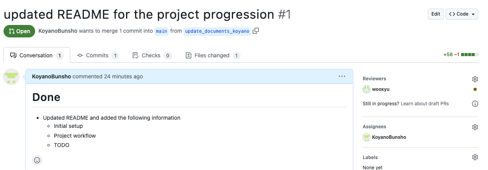
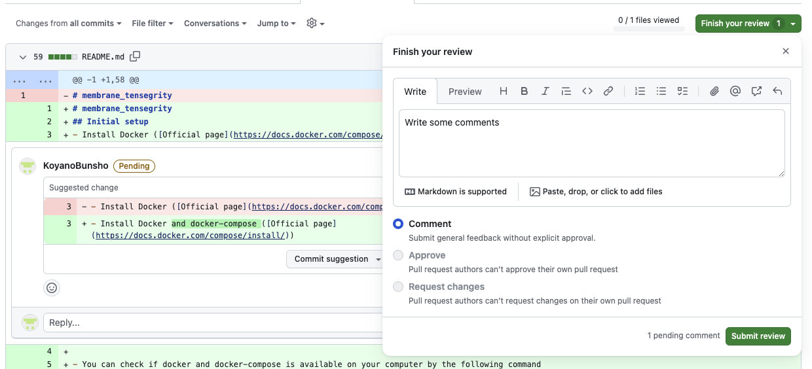
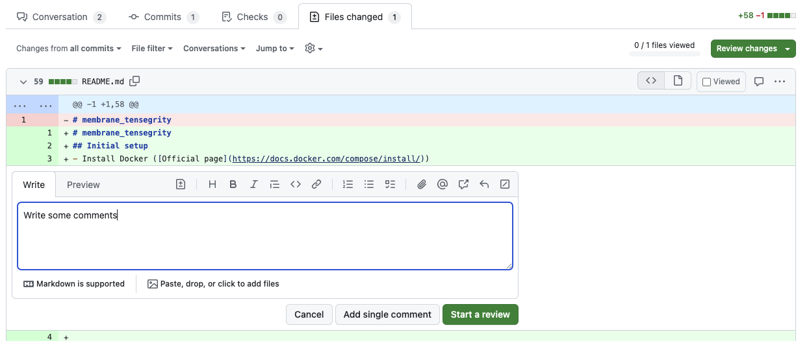

# GitHubでのPull Request (PR) Review方法

Created by: KOYANOBunsho
Created time: December 15, 2023 3:32 PM
Tags: GitHub

## Summary of how to review GitHub PR

- First, go to the “Files changed” page from the Conversation page

- In the “Files changed” page, if you find some mistakes in the code, you can click the + button of the specific line and write comments as follows.

- When writing comments, some functions in GitHub are useful. For example, when you click “Add a suggestion” button, you can suggest a change in the code as follows.

[画面収録 2023-12-15 15.37.27.mov](pic/prre.mov)

- Just do not forget to finish your review :)

