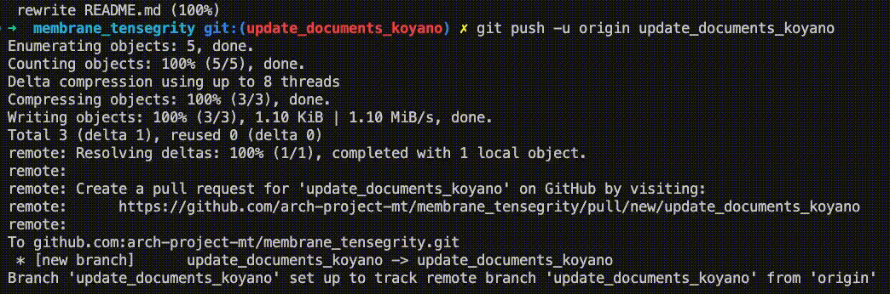
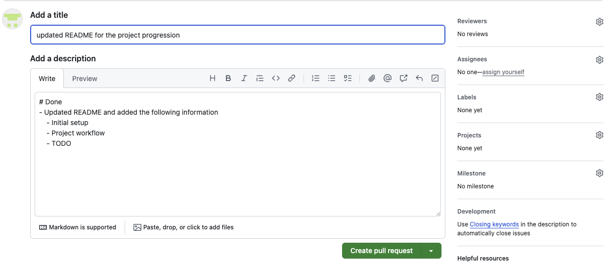
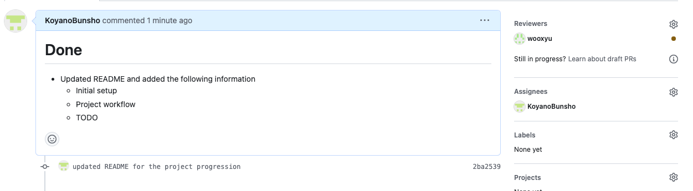

# GitHubでのPull Request (PR)作成方法

Created by: KOYANOBunsho
Created time: December 15, 2023 1:16 PM
Tags: GitHub

## 概要

- 複数人で同一のコードを編集する際はコードのversion管理を行うことが有効であり，version管理にはGitHubなどのツールがよく用いられる
- 本ドキュメントでは，以下のレポジトリ上でコードを変更してPRを作成するまでの流れをまとめる

[https://github.com/arch-project-mt/membrane_tensegrity](https://github.com/arch-project-mt/membrane_tensegrity)

- 新しいブランチの作成コマンド

```bash
git switch -c <your branch name>
```

- 編集したファイルをpushするコマンド

```bash
git add <modified file>
git commit -m "<your commit message>"
git push -u origin <your branch name>
```

- PRの作成
    - git pushコマンドを実行した後，(Macの場合は)commandを押しながらhttpsリンクをクリックすると，以下のPR作成画面に遷移する





- PRのレビュー
    - Assignee (自分)とReviewerを指定(自分以外のメンバー)
    - 無料版のGitHubグループではReviewerは一人しか設定できないようです，，，


