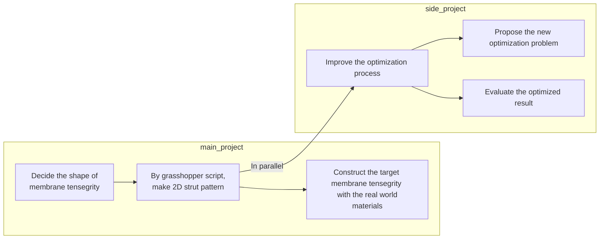
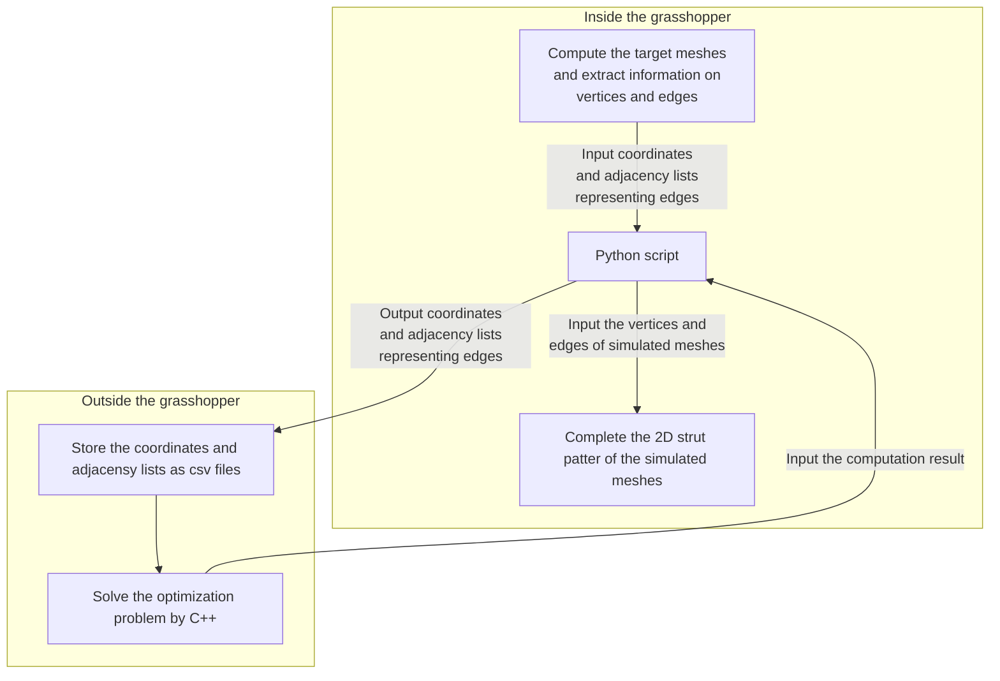
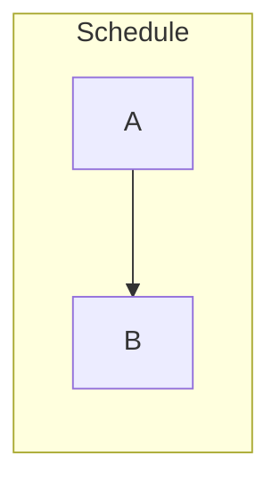

# Mermaidを用いたフローチャートの作成方法

Created by: KOYANOBunsho
Created time: December 16, 2023 1:03 PM
Tags: Markdown

## 概要

- Groupworkの円滑な進行や進捗報告を行うためにMermaidを用いたフローチャートが便利になると考えられる
- 本ドキュメントでは，Groupworkで必要になるフローチャートを作成するためのMermaidコードをまとめる
- Mermaidコードの作成は，以下のWebページを参考にした

[Mermaid入門](https://zenn.dev/kento_mm_ninw/articles/8b10afdbef306a)

## Workflow for the whole project

## Computational flow for the subproject

## Schedule

